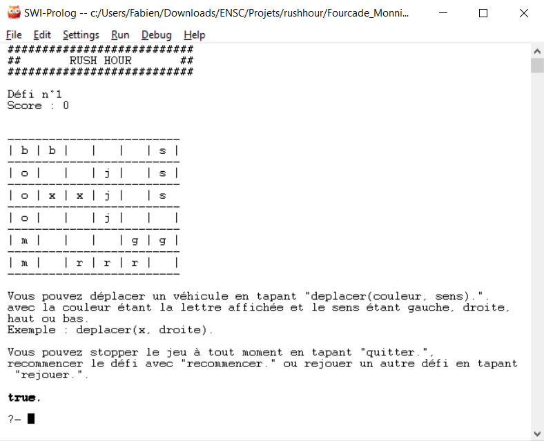

# Rush Hour

Rush Hour est un casse-tête, ici reproduit sur une interface semi-graphique en langage Prolog. 

Sur le plateau, sont disposés véhicules qui ne peuvent être déplacés que dans un sens (haut et bas, ou gauche et droite). La voiture du joueur, notée ici par des 'x', doit être amenée vers la sortie.

## Jouez !

L'application a été développée pour fonctionner sur [SWI-Prolog](http://www.swi-prolog.org/Download.html) sur Windows. Pour éviter des conflits sur les chemins relatifs, il est préférable de lancer le fichier "rushhour.pl" dans SWI-Prolog directement depuis le dossier où il est situé (clic droit, "Ouvrir avec").

Pour lancer le jeu, une fois l'application ouverte, écrivez la commande "demarrer." Le choix du scénario et les commandes sont ensuite expliquées dans le jeu. Chaque instruction doit être suivie d'un point pour être interprêtée.

Ce jeu a été développé par Julien Fourcade et Fabien Monniot, reproduit d'après le jeu de plateau produit par la société Thinkfun.

[Télécharger l'application](https://github.com/fabienmonniot/rushhour)